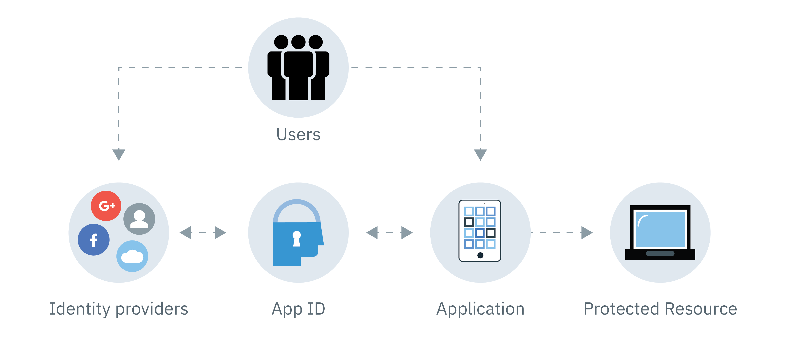

---

copyright:
  years: 2017, 2019
lastupdated: "2019-02-21"

---

{:new_window: target="_blank"}
{:shortdesc: .shortdesc}
{:screen: .screen}
{:codeblock: .codeblock}
{:pre: .pre}
{:tip: .tip}
{:note: .note}

# About {{site.data.keyword.appid_short_notm}}
{: #about}

Application security can be incredibly complicated. For most developers, it's one of the hardest parts of creating an app. How can you be sure that you are protecting your user's information? By integrating {{site.data.keyword.appid_full}} into your apps, you can secure resources and add authentication, even when you don't have much security experience.
{:shortdesc}

## Reasons to use the service
{: #about-reasons}

{{site.data.keyword.appid_short_notm}} helps developers to easily add authentication to their web and mobile apps with few lines of code, and secure their Cloud-native applications and services on {{site.data.keyword.Bluemix_notm}}. By requiring users to sign in to your app, you can store user data such as app preferences, or information from public social profiles, and then leverage that data to customize each user's experience within the app. {{site.data.keyword.appid_short_notm}} provides a log-in framework for you, but you can also bring your own branded sign in screens to use with cloud directory.
{: shortdesc}

Why would you want to use {{site.data.keyword.appid_short_notm}}? Check out the following scenarios to see whether any of them apply to you.

<table>
  <tr>
    <th>Scenario</th>
    <th>Solution</th>
  </tr>
  <tr>
    <td>You need to add [authorization and authentication](/docs/services/appid?topic=appid-key-concepts) to your mobile and web apps but don't have a background in security.</td>
    <td>{{site.data.keyword.appid_short_notm}} makes it easy to add an authentication step to your apps. You can add email or username sign in, social sign in, or enterprise sign in to your apps with APIs, SDKs, prebuilt UIs, or your own branded UIs.</td>
  </tr>
  <tr>
    <td>You want to limit access to your apps and back-end resources.</td>
    <td>You can secure your apps, back-end resources, and APIs easily by using the standards based authentication provided by {{site.data.keyword.appid_short_notm}}.</td>
  </tr>
  <tr>
    <td>You want to build personalized app experiences for your users.</td>
    <td>With {{site.data.keyword.appid_short_notm}}, you can [store user data](/docs/services/appid?topic=appid-user-profile) such as app preferences or information from their public social profiles, and then use that data to customize each experience of your app.</td>
  </tr>
  <tr>
    <td>You want to manage users in a scalable way.</td>
    <td> {{site.data.keyword.appid_short_notm}} allows you to create a [Cloud Directory](/docs/services/appid?topic=appid-cloud-directory), which makes it possible for you to add user sign-up and sign-in to your apps. Cloud Directory provides you with the framework to maintain a user registry that can scale with your user base. With the pre-built functionality for self service, such as email verification and password resets, you can be sure that your app is authenticating users securely.</td>
  </tr>
</table>

## How it works
{: #about-how-it-works}

With {{site.data.keyword.appid_short_notm}}, you can add a level of security to your apps by requiring users to sign in. You can also use the server SDK or APIs to protect your back-end resources.
{: shortdesc}

<dl>
  <dt>Application</dt>
    <dd><strong>Server SDK</strong>: You can protect your back-end resources that are hosted on {{site.data.keyword.Bluemix_notm}} and your web apps by using the server SDK. It extracts the access token from a request and validates it with {{site.data.keyword.appid_short_notm}}.  
    <strong>Client SDK</strong>: You can protect your mobile apps with the Android or iOS client SDK. The client SDK communicates with your cloud resources to start the authentication process when it detects an authorization challenge.</dd>
  <dt>{{site.data.keyword.Bluemix_notm}}</dt>
    <dd><strong>{{site.data.keyword.appid_short_notm}}</strong>: After successful authentication, {{site.data.keyword.appid_short_notm}} returns access and identity tokens to your app. 
    <strong>Cloud directory</strong>: Users can sign up for your service with their email and a password. You can then manage your users in a list view through the UI. With cloud directory, {{site.data.keyword.appid_short_notm}} functions as your identity provider.</dd>
  <dt>External (third party)</dt>
    <dd><strong>Social and enterprise identity providers</strong>: {{site.data.keyword.appid_short_notm}} supports Facebook, Google+,and  SAML 2.0 Federation as identity provider options. The service arranges a redirect to the identity provider and verifies the returned authentication tokens. If the tokens are valid, the service grants access to your app without ever having access to the actual passphrase.</dd>
</dl>

## Integrations
{: #about-integrations}

You can use {{site.data.keyword.appid_short_notm}} with other {{site.data.keyword.Bluemix_notm}} offerings.
{:shortdesc}

<dl>
  <dt>{{site.data.keyword.containerlong_notm}}</dt>
    <dd>By configuring Ingress in a standard cluster, you can secure your apps at the cluster level. Check out the <a href="/docs/containers?topic=containers-ingress_annotation#appid-auth">{{site.data.keyword.appid_short_notm}} authentication Ingress annotation</a> or the <a href="https://www.ibm.com/blogs/bluemix/2018/05/announcing-app-id-integration-ibm-cloud-kubernetes-service/">Announcing {{site.data.keyword.appid_short_notm}} integration to {{site.data.keyword.containerlong_notm}} </a> blog post to get started.</dd>
  <dt>{{site.data.keyword.openwhisk}} and API Connect</dt>
    <dd>When you create your APIs with [{{site.data.keyword.openwhisk_short}}](/docs/openwhisk?topic=cloud-functions-index) and [API Connect](/docs/services/apiconnect?topic=apiconnect-index), you can secure your applications at the gateway rather than in your app code. To see the integration in action, watch <a href="https://www.youtube.com/watch?v=Fa9YD2NGZiE" target="_blank">Simple and fast social login OAUTH with APIC and {{site.data.keyword.appid_short_notm}} </a>.</dd>
  <dt>Cloud Foundry</dt>
    <dd>Try out one of the provided sample Cloud Foundry apps to see how you can integrate {{site.data.keyword.appid_short_notm}} into your apps.</dd>
  <dt>{{site.data.keyword.cloudaccesstrailshort}}</dt>
    <dd>You can monitor administrative activity that is made in {{site.data.keyword.appid_short_notm}} such as changes to the dashboard configuration, by using the [{{site.data.keyword.cloudaccesstrailshort}} service](/docs/services/cloud-activity-tracker?topic=cloud-activity-tracker-getting-started-with-cla).</dd>
  <dt>iOS Programming Guide</dt>
    <dd>Do you develop apps for Apple? Try out the <a href="/docs/swift?topic=swift-set_up" target="_blank">iOS programming guide </a> to learn, experiment, and enhance your existing iOS apps with {{site.data.keyword.Bluemix_notm}}.</dd>
  <dt>Node.js programming guide</dt>
    <dd>Do you develop apps in Node.js? Try out the <a href="/docs/node?topic=nodejs-getting-started-tutorial" target="_blank">Node.js programming guide </a> to learn, experiment, and enhance your existing Node.js apps with {{site.data.keyword.Bluemix_notm}}.</dd>
</dl>
__

## Regional high-availability
{: #ha-dr}

{{site.data.keyword.appid_short_notm}} is a highly available, regional service that runs in multiple zones.
{: shortdesc}

In each supported multizone region, every zone has its own {{site.data.keyword.containerlong_notm}} cluster with several worker nodes. Each worker node runs several instances of {{site.data.keyword.appid_short_notm}} components. Each region is fronted by a global load balancer and a web application firewall.

Data that is stored in {{site.data.keyword.appid_short_notm}} is encrypted and persisted in a database cluster that is spread across availability zones. The data is also back up in a separate encrypted object storage.

Because {{site.data.keyword.appid_short_notm}} is a regional service, it does not provide automated cross-regional failover or cross-regional disaster recovery. However, {{site.data.keyword.appid_short_notm}} does provide an <a href="https://us-south.appid.cloud.ibm.com/swagger-ui/#/" target="_blank">extensive API</a> that developers can use to manually synchronize their service configuration with another instance or instances of {{site.data.keyword.appid_short_notm}}.
