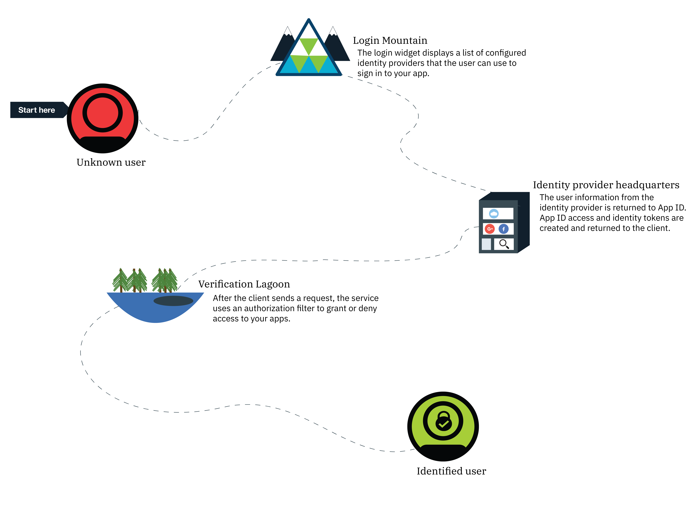
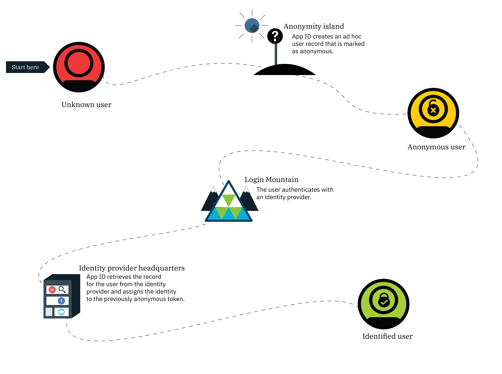

---

copyright:
  years: 2017, 2019
lastupdated: "2019-03-06"

keywords: authentication, authorization, identity, app security, secure, anonymous, progressive, profiles, sign in

subcollection: appid

---

{:new_window: target="_blank"}
{:shortdesc: .shortdesc}
{:screen: .screen}
{:pre: .pre}
{:table: .aria-labeledby="caption"}
{:codeblock: .codeblock}
{:tip: .tip}
{:note: .note}
{:important: .important}
{:deprecated: .deprecated}
{:download: .download}

# Anonymous authentication
{: #anonymous}

When developing apps, one of the biggest concerns is security. How can you ensure that only users with the right access, are using your app? You need to use an authorization process. In most processes authorization and authentication are coupled together, which can make changing your security policies and identity providers complicated. With {{site.data.keyword.appid_full}}, authorization and authentication are separate processes.
{: shortdesc}

When a user successfully signs in, they become an identified user. The identity provider returns access and identity tokens that contain information about the user to {{site.data.keyword.appid_short}}. The service takes the provided tokens and determines whether a user has the proper credentials to access an app. If the tokens are validated, then the service authorizes the users access to the app. The authentication information is associated with the user's profile after they are authorized. The profile and its attributes can be accessed again from any client that authenticates with the same identity provider.

## Progressive authentication
{: #progressive}

With {{site.data.keyword.appid_short_notm}}, an anonymous user can choose to become an identified user.

When a user chooses not to sign in immediately, they are considered an anonymous user. For example, a user might immediately start adding items to a shopping cart without signing in. For anonymous users, {{site.data.keyword.appid_short_notm}} creates an ad hoc user profile and calls the OAuth login API that returns anonymous access and identity tokens. By using these tokens, the app can create, read, update, and delete the attributes that are stored in the user profile.

When an anonymous user signs in, their access token is passed to the login API. The service authenticates the call with an identity provider. The service uses the access token to find the anonymous profile and attaches the user's identity to it. The new access and identity tokens contain the public information that is shared by the identity provider. After a user is identified, their anonymous token becomes invalid. However, a user is still able to access their attributes because they're accessible with the new token.

An identity can be assigned to an anonymous profile only if it is not already assigned to another user.
{: tip}

If the identity is already associated with another {{site.data.keyword.appid_short_notm}} user, the tokens contain information of that user profile and provide access to their attributes. The previous anonymous user's attributes are not accessible through the new token. Until the token expires, the information can still be accessed through the anonymous access token. While you develop your app, you can choose how to merge the anonymous attributes to the known user.
