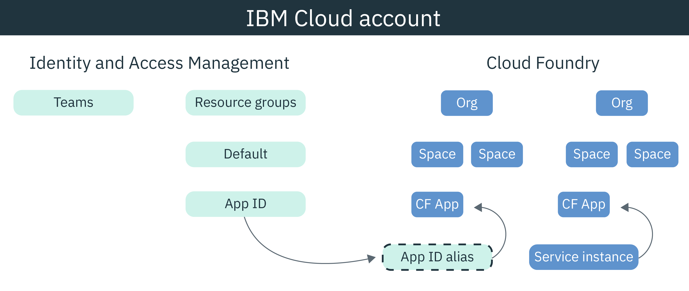

---

copyright:
  years: 2014, 2019
lastupdated: "2019-03-06"

---

{:new_window: target="_blank"}
{:shortdesc: .shortdesc}
{:screen: .screen}
{:pre: .pre}
{:table: .aria-labeledby="caption"}
{:codeblock: .codeblock}
{:tip: .tip}
{:note: .note}
{:important: .important}
{:deprecated: .deprecated}
{:download: .download}


# Tutorial: Configuring Cloud Foundry to use {{site.data.keyword.appid_short_notm}}
{: #cloud-foundry}

With {{site.data.keyword.cloud_notm}}, you can protect your apps with two different types of access management, (IAM) and Cloud Foundry. By default, all new instances of  {{site.data.keyword.appid_short_notm}} use IAM resource groups to manage access. If you are using Cloud Foundry to manage your application, you can bridge the management models by creating a service alias and binding the service to the app.
{: shortdesc}


## Understanding Cloud Foundry
{: #cf-understand}

An alias creates a connection between your IAM-managed service such as {{site.data.keyword.appid_short_notm}} and your Cloud Foundry application. When you bind an application, service credentials are created and automatically passed to the app. Although binding is a required step in the configuration, it has the following benefits:

* Automation: With the service credentials stored in the VCAP_SERVICES environment variable, you no longer need to manually copy them to the app. It's all done behind the scenes on your behalf with the {{site.data.keyword.appid_short_notm}} SDKs.
* Safety: Configuration becomes error-proof because the process is automatic.
* Security: Nothing access related is hard-coded into your application as the service credentials only exist in the environment variables.

Is your Cloud Foundry app hosted on another platform? No problem. You can define application credentials in your app to bind it to the service. You can find your application credentials through the {{site.data.keyword.appid_short_notm}} dashboard, or by making a request to the [/applications endpoint](https://us-south.appid.cloud.ibm.com/swagger-ui/#!/Applications/registerApplication).
{: tip}

Check out how the models fit together in the following diagram:



## Before you begin
{: #cf-before}

Before you get started, be sure that you have the following prerequisites:

* An {{site.data.keyword.cloud_notm}} account
* An instance of {{site.data.keyword.appid_short_notm}}
* The [{{site.data.keyword.cloud_notm}} CLI](/docs/cli/reference/ibmcloud?topic=cloud-cli-ibmcloud-cli#ibmcloud-cli) installed locally

## Deploying a Node.js app
{: #cf-node}


1. Navigate to your instance of {{site.data.keyword.appid_short_notm}}.

2. Click **Download Sample** on the **Overview** tab of the service dashboard.

3. Click **Node.js**. Download and extract the sample app.

4. Verify that you have all of the Node.js prerequisites.

5. Open terminal and change into the sample folder.

6. Login to {{site.data.keyword.cloud_notm}} through the CLI.

  ```
  ibmcloud login -api -a https://api.<region>.cloud.ibm.com
  ```
  {: pre}

  <table>
    <tr>
      <th>Region</th>
      <th>Endpoint</th>
    </tr>
    <tr>
      <td>Dallas</td>
      <td><code>us-south</code></td>
    </tr>
    <tr>
      <td>Frankfurt</td>
      <td><code>eu-de</code></td>
    </tr>
    <tr>
      <td>Sydney</td>
      <td><code>au-syd</code></td>
    </tr>
    <tr>
      <td>London</td>
      <td><code>eu-gb</code></td>
    </tr>
    <tr>
      <td>Tokyo</td>
      <td><code>jp-tok</code></td>
    </tr>
  </table>

7. Target the Cloud Foundry organization and space that you want to work in.

  ```
  ibmcloud target --cf
  ```
  {: pre}

8. Create an alias of the {{site.data.keyword.appid_short_notm}} service instance.

  ```
  ibmcloud resource service-alias-create {ALIAS_NAME} --instance-name {SERVICE_INSTANCE_NAME}
  ```
  {: pre}

9. Edit the host and name values in your project's `manifest.yml` with the information obtained in the previous command. Add the alias that you create to your services.

10. Bind the services that are listed in the `manifest.yml` file by deploying the sample app.

  ```
  ibmcloud app push
  ```
  {: pre}

## Deploying a Java app
{: #java}

1. Navigate to your instance of {{site.data.keyword.appid_short_notm}}.

2. Click **Download Sample** on the **Overview** tab of the service dashboard.

3. Click **Java**. Download and extract the sample app.

4. Verify that you have all of the Java prerequisites.

5. Open terminal and change into the sample folder.

6. Generate your `war` file and upload it.

  ```
  mvn clean install
  ```
  {: pre}

7. Change into the Liberty folder.

8. Login to IBM Cloud through the CLI.

  ```
  ibmcloud login -api ENDPOINT
  ```
  {: pre}

9. Target the Cloud Foundry organization and space that you want to work in.

  ```
  ibmcloud target --cf
  ```
  {: pre}

10. Create an alias of the {{site.data.keyword.appid_short_notm}} service instance.

  ```
  ibmcloud resource service-alias-create {ALIAS_NAME} --instance-name {SERVICE_INSTANCE_NAME}
  ```
  {: pre}

11. Edit the host and name values in your project's `manifest.yml` with the information obtained in the previous command. Add the alias that you create to your services.

  Example:
  ```
    applications:
  - name: ApplicationName
    host: HostName
    buildpack: liberty-for-java
    instances: 1
    memory: 512M
    disk_quota: 1024M
    timeout: 180
    services:
    - AppID-alias
  ```
  {: screen}

13. Bind the services that are listed in the `manifest.yml` file by deploying the sample app.

  ```
  ibmcloud app push
  ```
  {: pre}

